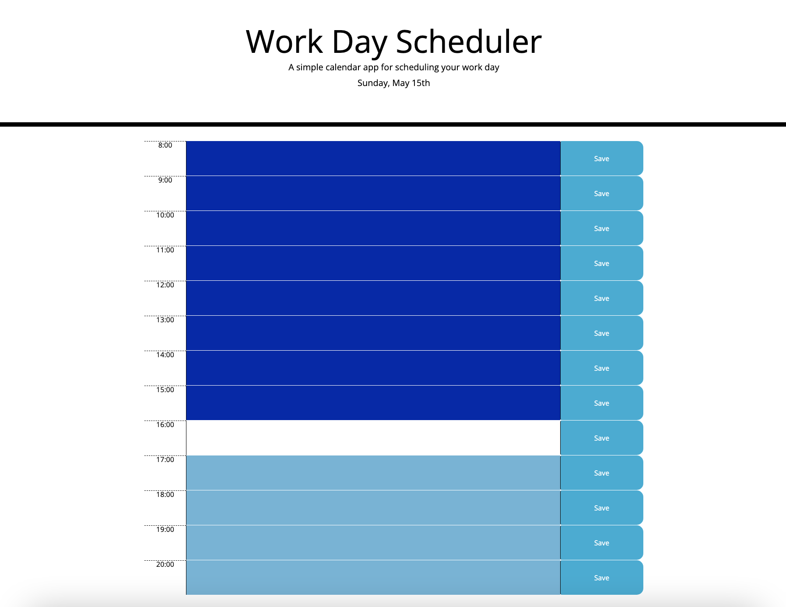

# Homework 5 - Planner

# Description

- Daily planner that allows user to input events into timeblocks within the calendar.

# Site Preview

# Github Links

- Respository: https://github.com/mxhuisken/hw5_planner
- Deployed: https://mxhuisken.github.io/hw5_planner/

# Requirements 

- Planner opens to current day, that date should be displayed at top of calendar 
- Timeblocks should be presented in standard business hours as user scrolls
- Timeblocks should be color coded to indicate whether it is in the past, present, or future
- When clicking a timeblock user should be able to enter details for event 
- When user clicks save button, the event details will be saved in local storage 
- When user refreshes page, saved events should display